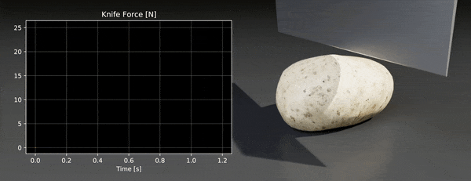

# DiSECt: Differentiable Simulator for Robotic Cutting

## [**Website**](https://diff-cutting-sim.github.io) | [**Paper**](https://arxiv.org/abs/2105.12244) | [**Dataset**](https://drive.google.com/file/d/1wucF6uyerdcrRPxZ88hfWOLv3pfCisNu/view?usp=sharing) | [**Video**](https://youtu.be/bN4yqHhfAfQ) | [**Blog post**](https://developer.nvidia.com/blog/nvidia-research-disect-a-differentiable-simulation-engine-for-autonomous-robotic-cutting/)



DiSECt is a simulator for the cutting of deformable materials. It uses the Finite Element Method (FEM) to simulate the deformation of the material, and leverages a virtual node algorithm to introduce springs between the two halves of the mesh being cut. These cutting springs are weakened in proportion to the knife forces acting on the material, yielding a continuous model of deformation and crack propagation. By leveraging source code transformation, the back-end of DiSECt automatically generates CUDA-accelerated kernels for the forward simulation and the gradients of the simulation inputs. Such gradient information can be used to optimize the simulation parameters to achieve accurate knife force predictions, optimize cutting actions, and more.

## Prerequisites

* Python 3.6 or higher
* PyTorch 1.4.0 or higher
* Pixar USD lib (for visualization)

Pre-built USD Python libraries can be downloaded from https://developer.nvidia.com/usd, once they are downloaded and extracted, you should follow the instructions in the corresponding `README.txt` to add the pre-built libraries to your `PYTHONPATH` environment variable. Besides using the provided basic visualizer implemented using pyvista, DiSECt can generate USD files for rendering, e.g. in NVIDIA Omniverse™ or usdview.

### Using the built-in backend

By default, the simulation back-end uses the built-in PyTorch cpp-extensions mechanism to compile auto-generated simulation kernels.

- Windows users should ensure they have Visual Studio 2019 installed

## Installation

### Dataset
To set up our [dataset](https://drive.google.com/file/d/1wucF6uyerdcrRPxZ88hfWOLv3pfCisNu/view?usp=sharing) of meshes, simulated knife forces and nodal motion fields we recorded in the ANSYS LS-DYNA simulator, download [this zip file (96 MB)](https://drive.google.com/file/d/1wucF6uyerdcrRPxZ88hfWOLv3pfCisNu/view?usp=sharing) and extract it in the project folder, such that the folder `dataset` is at the top level.

We provide a `README.md` file with more details on the contents of this dataset in the `dataset` folder. The dataset is released under the [Creative Commons Attribution-NonCommercial 4.0 International License](https://creativecommons.org/licenses/by-nc/4.0/).

### Python dependencies
Next, set up the Python dependencies listed in [`requirements.txt`](requirements.txt) via
```sh
pip install -r requirements.txt
```

### Mesh processing library

See [`meshing/README.md`](./meshing/README.md) for instructions on how to install the recommended C++-based mesh cutting library that DiSECt relies on to process meshes.

### Mesh discretization

For the mesh discretization we provide an example script in [`cutting/tetrahedralization.py`](cutting/tetrahedralization.py) based on the [Wildmeshing Python API](https://wildmeshing.github.io/python) that can be used to generate a tetrahedral mesh from a triangle surface mesh, which allows it to be used in the FEM simulator.

## Examples

The following demos are provided and can be executed via `python examples/<example_name>.py`.

| Example | Description |
| :------------ | :------------- |
| `basic_cutting` | Cutting a prism shape with a knife following a slicing motion, running in the interactive pyvista 3D visualizer |
| `render_usd` | Demonstrates how to generate a USD file from the simulation |
| `optimize_slicing`    | Constrained optimization via [MDMM](https://github.com/crowsonkb/mdmm) to find a slicing motion of the knife that minimizes force while adhering to blade length and knife height constraints |
| `parameter_inference`    | Optimizes simulation parameters to match a knife force profile from one of the [measurements in our dataset](./dataset/forces) |


## Citation

```
@INPROCEEDINGS{heiden2021disect,
    AUTHOR    = {Eric Heiden AND Miles Macklin AND Yashraj S Narang AND Dieter Fox AND Animesh Garg AND Fabio Ramos},
    TITLE     = {{DiSECt: A Differentiable Simulation Engine for Autonomous Robotic Cutting}},
    BOOKTITLE = {Proceedings of Robotics: Science and Systems},
    YEAR      = {2021},
    ADDRESS   = {Virtual},
    MONTH     = {July},
    DOI       = {10.15607/RSS.2021.XVII.067}
}
```

## License

Copyright &copy; 2021, NVIDIA Corporation. All rights reserved.

This work is made available under the [NVIDIA Source Code License](LICENSE.md).
