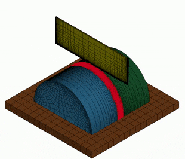
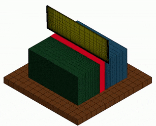
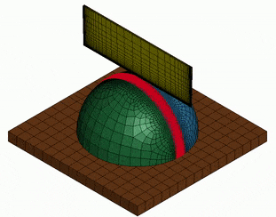

# Dataset of simulated cutting actions

As part of [DiSECt](https://diff-cutting-sim.github.io), we release our dataset generated in the commercial simulator Ansys LS-DYNA that contains force profiles and nodal motion trajectories from various shapes and materials being cut by a knife pressing down into the material.

## Material properties

| Name | Young's modulus *E* [N/m²] | Poisson's ratio *ν* | density *ρ* [kg/m³] |
| :------------ | :-------------: | :--------: | :-----: |
| `apple`    | 3.0e6 | 0.17 | 787 |
| `potato`    | 2.0e6 | 0.45 | 630 |
| `cucumber`    | 2.5e6 | 0.37 | 950 |

## Knife force profiles
The force profiles are in CSV format in the `forces/` subfolder and store the time-stamped 3D force acting on the knife as it presses vertically down into the material. Check out the `ANSYS.ipynb` Jupyter notebook for some examples on how to load and process these files.

<table>
    <thead>
        <tr>
            <th>Shape</th>
            <th>Force profile</th>
            <th>Material</th>
            <th>Knife Downward Velocity [mm/s]</th>
        </tr>
    </thead>
    <tbody>
        <tr>
            <td rowspan=7 align=center>
            cylinder 
            
            </td>
            <td><code>cylinder_fine_resultant_force_xyz.csv</code></td>
            <td align=center>cucumber</td>
            <td align=center>50</td>
        </tr>
        <tr>
            <td><code>cylinder_fine_vel35_resultant_force_xyz.csv</code></td>
            <td align=center>cucumber</td>
            <td align=center>35</td>
        </tr>
        <tr>
            <td><code>cylinder_fine_vel45_resultant_force_xyz.csv</code></td>
            <td align=center>cucumber</td>
            <td align=center>45</td>
        </tr>
        <tr>
            <td><code>cylinder_fine_vel55_resultant_force_xyz.csv</code></td>
            <td align=center>cucumber</td>
            <td align=center>55</td>
        </tr>
        <tr>
            <td><code>cylinder_fine_vel65_resultant_force_xyz.csv</code></td>
            <td align=center>cucumber</td>
            <td align=center>65</td>
        </tr>
        <tr>
            <td><code>cylinder_fine_prismprops_resultant_force_xyz.csv</code></td>
            <td align=center>potato</td>
            <td align=center>50</td>
        </tr>
        <tr>
            <td><code>cylinder_fine_sphereprops_resultant_force_xyz.csv</code></td>
            <td align=center>apple</td>
            <td align=center>50</td>
        </tr>
        <tr>
            <td rowspan=3 align=center>
            prism 
            
            </td>
            <td><code>prism_fine_resultant_force_xyz.csv</code></td>
            <td align=center>potato</td>
            <td align=center>50</td>
        </tr>
        <tr>
            <td><code>prism_fine_sphereprops_resultant_force_xyz.csv</code></td>
            <td align=center>apple</td>
            <td align=center>50</td>
        </tr>
        <tr>
            <td><code>prism_fine_cylinderprops_resultant_force_xyz.csv</code></td>
            <td align=center>cucumber</td>
            <td align=center>50</td>
        </tr>
        <tr>
            <td rowspan=7 align=center>
            sphere 
            
            </td>
            <td><code>sphere_fine_resultant_force_xyz.csv</code></td>
            <td align=center>apple</td>
            <td align=center>50</td>
        </tr>
        <tr>
            <td><code>sphere_fine_vel35_resultant_force_xyz.csv</code></td>
            <td align=center>apple</td>
            <td align=center>35</td>
        </tr>
        <tr>
            <td><code>sphere_fine_vel45_resultant_force_xyz.csv</code></td>
            <td align=center>apple</td>
            <td align=center>45</td>
        </tr>
        <tr>
            <td><code>sphere_fine_vel55_resultant_force_xyz.csv</code></td>
            <td align=center>apple</td>
            <td align=center>55</td>
        </tr>
        <tr>
            <td><code>sphere_fine_vel65_resultant_force_xyz.csv</code></td>
            <td align=center>apple</td>
            <td align=center>65</td>
        </tr>
        <tr>
            <td><code>sphere_fine_prismprops_resultant_force_xyz.csv</code></td>
            <td align=center>potato</td>
            <td align=center>50</td>
        </tr>
        <tr>
            <td><code>sphere_fine_cylinderprops_resultant_force_xyz.csv</code></td>
            <td align=center>cucumber</td>
            <td align=center>50</td>
        </tr>
    </tbody>
</table>

## Nodal motion trajectories

We record the 3D positions of a subset of the mesh vertices as the knife moves through the material in the `motions/` subfolder.

Check out the `ANSYS Nodes.ipynb` Jupyter notebook for some examples on how to load and process these files. The notbook merges the surface and interior node motions into a single numpy `npz` file, which we also include in the `motions/` subfolder. The `npz` files contain the following arrays:

| Key | Description |
| :------------ | :------------- | 
| `times`    | Time in seconds from the beginning of the simulation |
| `node_positions`    | XYZ coordinates of each node over time |
| `indices`    | Mesh indices of the nodes which have been recorded |

Note that the following files are split into the surface nodes named `left_right_surf_nodes` and the interior nodes close to the cutting surface named `middle_nodes`. In all these trajectory files, the knife is moving at a constant 50 mm/s vertical velocity downwards.

<table>
    <thead>
        <tr>
            <th>Shape</th>
            <th>Trajectory file</th>
            <th>Material</th>
        </tr>
    </thead>
    <tbody>
        <tr>
            <td rowspan=3 align=center>
            cylinder 
            
            </td>
            <td><code>cylinder_fine_left_right_surf_nodes_xyz.csv</code></td>
            <td rowspan=3 align=center>cucumber</td>
        </tr>
        <tr>
            <td><code>cylinder_fine_middle_nodes_xyz.csv</code></td>
        </tr>
        <tr>
            <td><code>cylinder_node_xyz.npz</code></td>
        </tr>
        <tr>
            <td rowspan=3 align=center>
            prism 
            
            </td>
            <td><code>prism_fine_left_right_surf_nodes_xyz.csv</code></td>
            <td rowspan=3 align=center>potato</td>
        </tr>
        <tr>
            <td><code>prism_fine_middle_nodes_xyz.csv</code></td>
        </tr>
        <tr>
            <td><code>prism_node_xyz.npz</code></td>
        </tr>
        <tr>
            <td rowspan=3 align=center>
            sphere 
            
            </td>
            <td><code>sphere_fine_left_right_surf_nodes_xyz.csv</code></td>
            <td rowspan=3 align=center>apple</td>
        </tr>
        <tr>
            <td><code>sphere_fine_middle_nodes_xyz.csv</code></td>
        </tr>
        <tr>
            <td><code>sphere_node_xyz.npz</code></td>
        </tr>
    </tbody>
</table>

## Acknowledgements

We thank Krishna Mellachervu for outstanding technical support.

## License

This dataset is provided under the [Creative Commons Attribution-NonCommercial 4.0 International License](https://creativecommons.org/licenses/by-nc/4.0/).